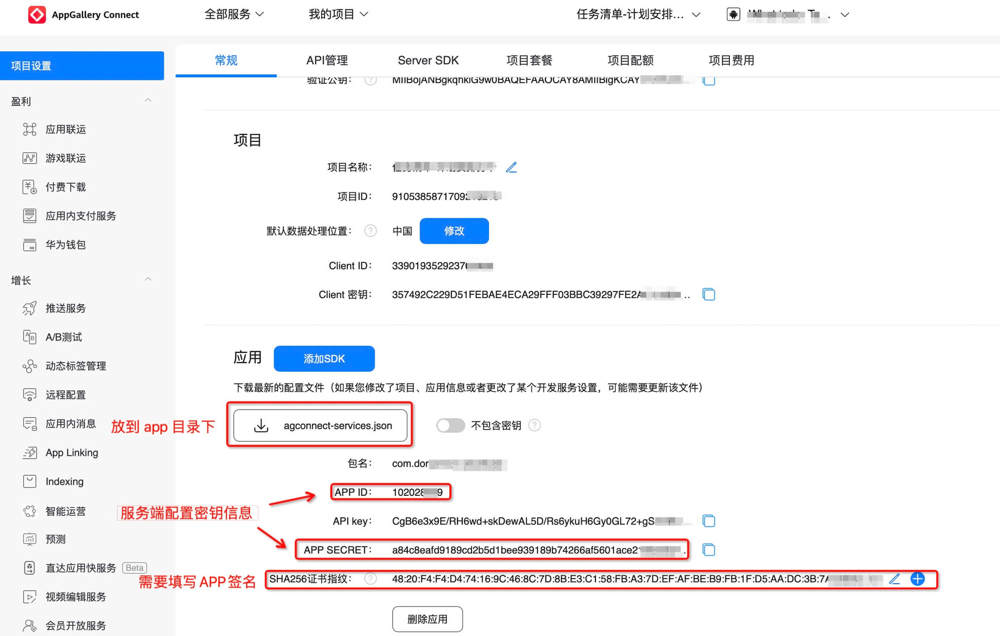

# china_push

基于 [极光推送](http://jiguang.cn/)
的思想，快速集成了六个厂商的推送平台，共享系统的厂商推送通道，避免APP需要长期在后台运行，杀死APP也能收到推送，大大提高推送到达率。接入有一定的开发成本，需要前后端一起参与才可以完成，如果遇到什么问题可以发Issue提问解答。

1. 开发者只需要少量代码即可集成 小米、华为、荣耀、OPPO、VIVO，苹果的厂商推送；

2. 根据手机厂商推送的支持情况智能选择不同的推送；

3. 共享系统推送通道，杀死APP也能收到推送，推送到达率高达90%以上；

4. 提供服务端的Java代码，方便开发者快速实现服务端；

> 为什么弃用极光改为自己重构？
>
> 极光SDK读取隐私次数和恶意行为太多，导致每次审核都会卡在极光。痛定思痛决定自己开发

#### 厂商推送平台介绍

在以前没有厂商推送的情况下，各家公司或推送平台为了让APP可以在后台收到推送，会通过各种方式让APP保持后台运行，甚至还会出现`APP之间相互唤醒`
。近年来，手机系统的管控越来越严格，不再允许后台运行也不允许APP相互唤醒

| 推送平台                                                                                                                                              | 透传  | 全局推送 | 别名/标签 | 支持说明                                  |
|---------------------------------------------------------------------------------------------------------------------------------------------------|-----|------|-------|---------------------------------------|
| [小米推送](https://dev.mi.com/console/appservice/push.html)                                                                                           | 支持  | 支持   | 支持    | 所有Android设备，小米设备支持系级别推送，其它设备支持普通推送    |
| [华为推送](https://developer.huawei.com/consumer/cn/console)                                                                                          | 支持  | 不支持  | 不支持   | 仅华为设备，部分EMUI4.0和4.1，及EMUI5.0及之后的华为设备。 |
| [OPPO推送](https://push.oppo.com)                                                                                                                   | 不支持 | 支持   | 支持    | 仅OPPO和一加手机，支持ColorOS3.1及以上的系统。        |
| [VIVO推送](https://dev.vivo.com.cn/openAbility/pushNews)                                                                                            | 不支持 | 支持   | 支持    | 仅VIVO手机，部分 Android 9.0，及 9.0 以上手机     |
| [荣耀推送](https://developer.honor.com/cn/tg/page/tg2022092817400001?navation=dh41628589245436395522%2F1)                                             | 不支持 | 支持   | 支持    | 仅魅族手机，Flyme系统全平台                      |
| [APNs](https://developer.apple.com/documentation/usernotifications/setting_up_a_remote_notification_server/sending_notification_requests_to_apns) | 不支持 | 不支持  | 不支持   | 仅苹果设备                                 |
| [小米推送 APNs](https://dev.mi.com/console/doc/detail?pId=98)                                                                                         | 不支持 | 支持   | 支持    | 仅苹果设备，代替APNs，可以有效降低服务器压力              

### 注册各大的推送平台的账号

这个步骤在这里就不详细展开说了，自行注册配置，除了小米推送外，其它推送都必须要公司主体才可以申请，请务必注意，避免浪费时间。

## Android 客户端配置

#### 修改项目的根目录 build.gradle

```groovy
buildscript {
    repositories {
        ...
        mavenCentral()
        maven { url 'http://developer.huawei.com/repo/' }
        maven { url "https://developer.hihonor.com/repo" }
    }
    dependencies {
        ...
        classpath 'com.huawei.agconnect:agcp:1.9.1.301'
        classpath 'com.hihonor.mcs:asplugin:2.0.1.300'
    }
}
allprojects {
    repositories {
        ...
        mavenCentral()
        jcenter()
        maven { url 'http://developer.huawei.com/repo/' }
        maven { url "https://developer.hihonor.com/repo" }
    }
}
```

#### 修改 app 目录的 build.gradle

小米、VIVO和荣耀需要在推送管理后台创建项目并且把对应的APP_ID和APP_KEY配置到文件中，OPPO比较特殊，是配置 APP_KEY 和
APP_SECRET。

```groovy
apply plugin: 'com.huawei.agconnect'
apply plugin: 'com.hihonor.mcs.asplugin'
android {
    compileSdkVersion 31
    defaultConfig {
        ...
        // 添加如下配置，并把你申请的配置填进去
        manifestPlaceholders = [
                MI_APP_ID      : "", //必须
                MI_APP_KEY     : "", //必须
                OPPO_APP_KEY   : "", //未填写则使用小米推送
                OPPO_APP_SECRET: "", //未填写则使用小米推送
                VIVO_APP_KEY   : "", //未填写则使用小米推送
                VIVO_APP_ID    : "", //未填写则使用小米推送
                HONOR_APP_ID   : "", //未填写则使用小米推送
                HMS_APP_ID     : "", //未填写则使用小米推送
        ]
    }
    repositories {
        flatDir {
            dirs 'libs'
        }
    }
}
```

#### 导入小米、vivo、oppo 推送依赖(aar)

1. 下载[所有依赖](https://github.com/developerHUA/flutter_push/tree/master/android/libs)
2. 导入到项目`yourFlutterProjec/android/app/libs`下面
3. 添加配置到`yourFlutterProjec/android/app/build.gradle`里面，如果已经有则忽略

```groovy
dependencies {
    implementation fileTree(dir: "libs", include: ["*.jar", "*.aar"])
}
```

#### 华为推送

华为推送麻烦一些，需要做3步配置：

1.
参考[官方文档](https://developer.huawei.com/consumer/cn/doc/development/HMSCore-Guides/android-app-quickstart-0000001071490422)
下载 `“agconnect-services.json”`并拷贝到app目录。
2. 配置SHA256证书指纹，否则会提示 **错误 6003 **
   ，详细查看[通用错误码](https://developer.huawei.com/consumer/cn/doc/development/HMS-2-References/hmssdk_huaweipush_api_reference_errorcode)。
3. 配置指纹证书，否则会提示 **错误 907135702**
   ，详细查看[通用错误码](https://developer.huawei.com/consumer/cn/doc/development/HMS-2-References/hmssdk_huaweipush_api_reference_errorcode)。



#### 荣耀推送

荣耀推送和华为推送类似，唯一区别是下载`“mcs-services.json”`文件后,放到`yourFlutterProjec/android/`
目录下,也就是`“agconnect-services.json”`上一层目录

注意：荣耀推送会验证应用包名和签名，请保证debug的应用签名和release一致

## Ios配置

#### 开启项目推送

1. 用Xcode打开你的ios项目
2. 选择Runner -> Signing & Capabilities
3. 选择你的开发团队，并为你的项目添加推送功能

#### 添加推送权限到pod.file

推荐使用[permission_handler](https://pub.dev/packages/permission_handler)申请推送权限

```groovy
post_install do |installer|
  installer.pods_project.targets.each do |target|
    flutter_additional_ios_build_settings(target)
      target.build_configurations.each do |config|
        config.build_settings['GCC_PREPROCESSOR_DEFINITIONS'] ||= [
                '$(inherited)',

            # dart: PermissionGroup.notification
            'PERMISSION_NOTIFICATIONS=1',
             ]
    end
  end
end

```
#### 初始化

初始化成功后会获取到regId和manufacturer(手机厂商)，上传给服务器

```dart
import 'package:china_push/china_push.dart';
  ChinaPush.initPush().then((value) {
      String? regId = value["regId"];
      String? manufacturer = value["manufacturer"];
      print("init success : $value");
    }, onError: (e) {
      print("init fail ${e.error}");
      setState(() {
        logs.add("init fail : ${e.error}");
      });
    });
```


#### 手动获取regId

获取regId，必须在初始化成功后再获取，否则为null

```dart
    ChinaPush.getRegId().then((value) {
      print("regId:$value");
    });
```

#### 手动获取自定义厂商信息

获取regId，必须在初始化成功后再获取，否则为null

```dart
    ChinaPush.getManufacturer().then((value) {
      print("manufacturer:$value");
    });
```


#### 设置通知栏被点击的监听

尽量保证`ChinaPush.setOnClickNotification`此代码，在`MainActivity.onCreate`之前就调用，否则应用冷启动可能无法回调


```dart
    // 建议在路由初始化后的首个界面里设置，否则应用冷启动会导致监听还没设置回调已经结束
    ChinaPush.setOnClickNotification((dynamic value) {
        print("onClickNotification : value : $value");
    });
```


### 问题汇总

##### [小米推送](https://dev.mi.com/console/doc/detail?pId=863)

1. MIUI日联网设备数≥10000时，当日可推送`普通消息`数量为MIUI日联网设备数*5。
2. 普通消息`
   每日推送数量有限，如果需要开发即时聊天/订单变化，请申请[通知消息权限](https://dev.mi.com/console/doc/detail?pId=2086#faq-permission)
   ，发送数量不受限制。
3. **使用使用miAPNS，并开启了沙箱，会导致Android手机无法收到推送（相当于只能在正式环境测试）**。

##### [OPPO推送](https://open.oppomobile.com/wiki/doc#id=10194)

1. 目前单日推送数量为：累计注册用户数\*2。
2.
目前私信处于公测阶段，需要申请才能开启私信通道，私信申请请参考[OPPO PUSH通道升级公测邀请](https://open.oppomobile.com/wiki/doc#id=10614)。
3. 必须在“通道配置 → 新建通道”模块中[登记通道](https://open.oppomobile.com/wiki/doc#id=10289)，再在发送消息时选择。

##### [VIVO推送](https://dev.vivo.com.cn/documentCenter/doc/156)

1. 目前vivo手机接收的消息为7:00-23:00，服务器允许推送时间为7:00-22:00，系统消息不受此时间限制。
2. 用户单应用每日运营消息接收条数`上限5条`，系统消息无限制。
3. 正式消息分为运营消息和系统消息，两者每日限制发送量均根据SDK订阅数推算，SDK订阅数小于10000，按10000计数；大于10000，则等于SDK订阅数。
4. 运营推送vivoSystemMessage必须设置为false，否则会被禁用推送功能。

##### [魅族推送](http://open-wiki.flyme.cn/doc-wiki/index#id?130)

1. 无需区分运营推送和系统消息。

##### [华为推送](https://developer.huawei.com/consumer/cn/doc/development/HMS-2-References/hmssdk_huaweipush_api_reference_errorcode)

1. 不支持全局推送，需要从数据库查询所有的regId进行推送，建议不要查询超过3个月没有打开APP的regId，降低推送压力。

##### [小米推送 APNs服务](https://dev.mi.com/console/doc/detail?pId=98)

1. 不支持透传功能。
2. 推荐用来代替APNs，可以有效降低服务器推送压力。

##### [APNs](https://developer.apple.com/documentation/usernotifications/setting_up_a_remote_notification_server/sending_notification_requests_to_apns)

1. 不支持全局推送，需要从数据库查询所有的regId进行推送，建议不要查询超过6个月没有打开APP的regId，降低推送压力。
2. 推送的证书需要区分正式和测试，并且有效期是一年，需要及时更换。

##### 需要区分运营推送和系统推送（通知栏渠道匹配）

由于运营推送每日推送的数量是有限，如果需要用于开发IM和订单变化的推送，推送的数量是不够的，为了解决这个问题，各家推送都有自己的规范，推出了“系统消息”推送。必须严格准守，运营推送严禁走系统消息通道，否则会被禁用。

- [Android 通用渠道适配](https://developer.android.com/training/notify-user/channels)
- [华为渠道适配](https://developer.huawei.com/consumer/cn/doc/development/HMS-Guides/push-other#channel_id)
- [OPPO渠道适配](https://open.oppomobile.com/wiki/doc#id=10289)
- [vivo推送消息分类功能说明](https://dev.vivo.com.cn/documentCenter/doc/359)
- [荣耀推送](https://developer.honor.com/cn/docs/11002/guides/notification-push-standards)
- [小米推送适配渠道](https://dev.mi.com/console/doc/detail?pId=2086#faq-permission)

